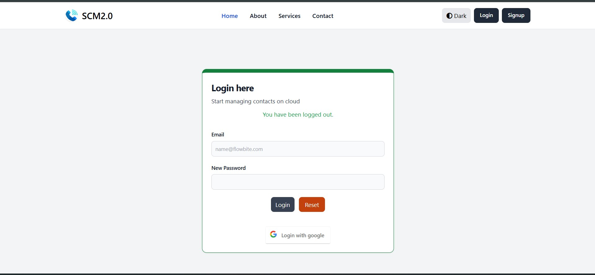
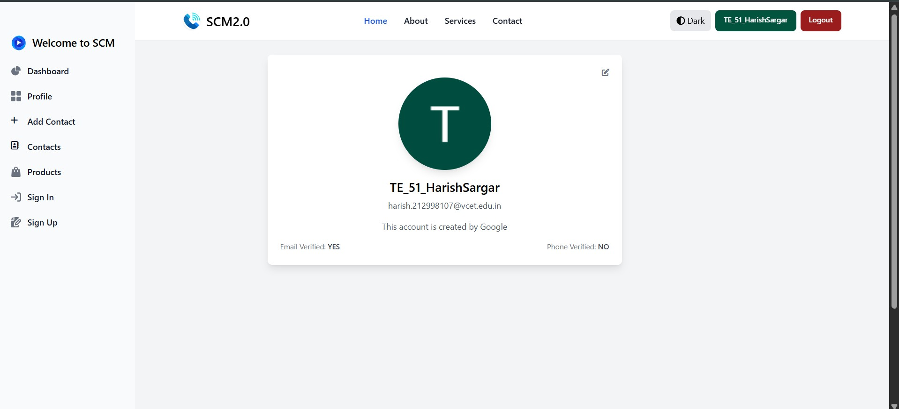
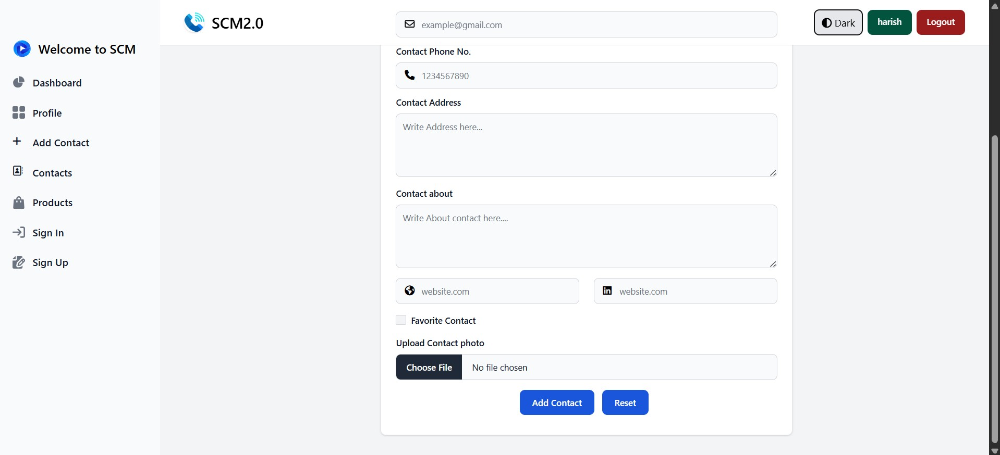
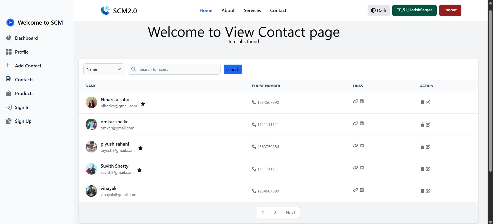

# 📒 Smart Contact Manager

A web-based contact management system built using **Spring Boot** and **Thymeleaf**, allowing users to securely store and manage personal or professional contacts with cloud image storage.

---

## 🚀 Features

- 🔐 User authentication & authorization (Spring Security)
- 🔒 Secure social login (Google/GitHub OAuth)
- 👥 Create, view, update, and delete contacts
- ☁️ Upload profile images to cloud storage (Cloudinary/AWS S3)
- 📄 Thymeleaf-powered dynamic templates
- 🗂️ Dashboard with pagination and contact search

---

## 🛠 Tech Stack

| Layer        | Technology                              |
|--------------|------------------------------------------|
| Backend      | Spring Boot, Spring MVC, Spring Security |
| Frontend     | Thymeleaf, Bootstrap                     |
| Database     | MySQL                                    |
| Cloud Storage| Cloudinary / AWS S3                      |
| Build Tool   | Maven                                    |

---

## 🖼 Project Screenshots

  
  
  
  

